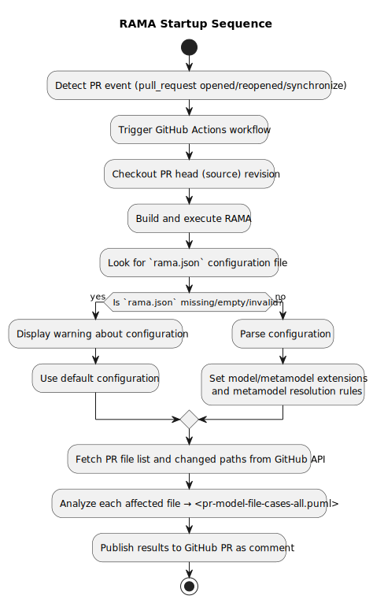
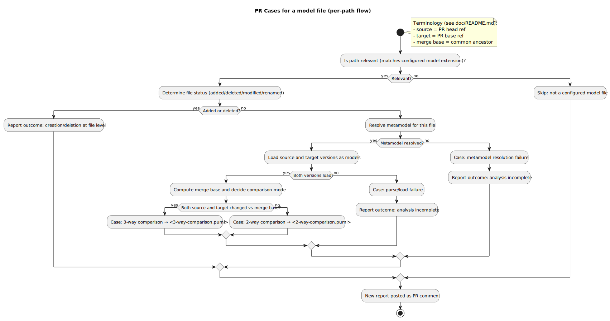
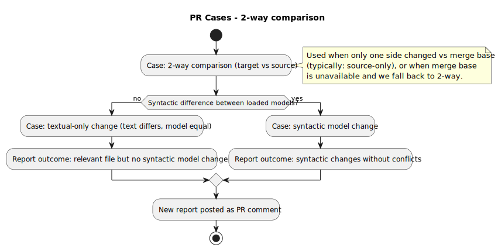
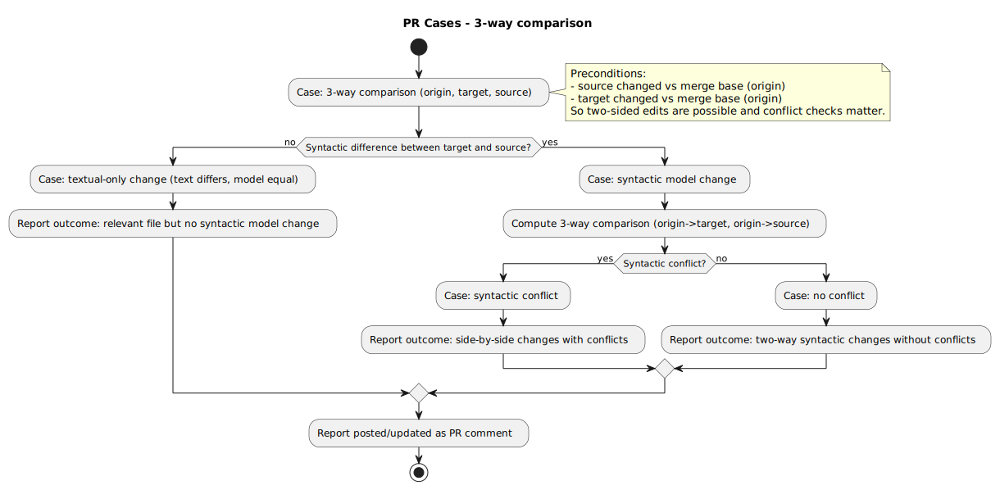

# PR Cases for a model file

This file lists the practical cases that can occur when a PR touches a file with a configured model extension. The cases are grouped by analysis dimension so they can be used both for implementation logic and for test design.

## Terminology mapping

- **GitHub API:** a pull request exposes `pull_request.head` (the source branch or head branch containing the proposed changes) and `pull_request.base` (the target branch into which the PR is merged). The common ancestor commit of those tips is available via the merge base endpoint (`GET /repos/:owner/:repo/merges/:base...:head`).
- **This document:** whenever we write *source branch* we mean the GitHub head ref and *target branch* means the GitHub base ref; *merge base* maps to the common ancestor commit from the `merges` API and is where we evaluate the origin-relative cases in section 2.
- **EMF Compare:** RAMA aligns the GitHub roles with EMF Compare sides as follows: the source branch tip becomes the *left* or *to/new* model, the target branch tip becomes the *right* or *from/old* model, and the merge base computation provides the *origin* or *ancestor* model that represents their shared history. This orientation matches Munidiff's add/remove direction when rendering reports.

## Behavior

At a high level, RAMA runs inside a GitHub Actions workflow on PR events. It loads configuration (from `rama.json` when present), inspects the PR changed paths, and for each relevant model/metamodel file decides which comparison mode applies (2-way or 3-way) before producing a new PR comment report.

The following diagrams summarize the main workflow:

### Startup

### Per-file flow (all cases)

### 2-way comparison

### 3-way comparison

## Cases

### 1. File-level cases

**Dimension →** file status

| ID | Case | Meaning | Typical handling |
| --- | --- | --- | --- |
| 1.1 | unchanged at PR tip | Source and target tips contain the same file content | Usually skip |
| 1.2 | added in source | File exists only in source branch | Analyze as creation |
| 1.3 | deleted in source | File exists only in target branch | Analyze as deletion |
| 1.4 | modified | File exists in both branches and contents differ | Pairwise compare |
| 1.5 | renamed or moved | Same logical file but path changed | Track rename if possible |
| 1.6 | extension changed into model | File was not previously treated as model, now it is | Analyze as newly relevant |
| 1.7 | extension changed out of model | File was previously model, now it is not | Report loss of relevance if needed |

### 2. Branch-origin cases relative to merge base

**Dimension →** branch origin

| ID | Case | Meaning | Why it matters |
| --- | --- | --- | --- |
| 2.1 | source-only changed | Source changed since merge base, target did not | No two-sided syntactic conflict expected |
| 2.2 | target-only changed | Target changed since merge base, source did not | PR context changed; re-analysis needed on PR update |
| 2.3 | both source and target changed | Both branches changed after divergence detection becomes relevant |

### 3. Textual change impact cases

**Dimension →** text impact

| ID | Case | Meaning | Examples |
| ---  | --- | --- | --- |
| 3.1 | serialization-only changes | Text differs but loaded model information is equivalent | trailing whitespace removal, indentation changes, line ending changes, serializer reordering that preserves syntactics, non-syntactic comments |
| 3.2 | syntactic model changes | Text differs and the EMF model information changes | object rename, attribute update, reference retargeting, object add/delete, containment move, ordered feature reorder |

### 4. Load and parse cases

**Dimension →** parsing

| ID | Case | Meaning | Typical report |
| --- | --- | --- | --- |
| 4.1 | both versions load | Source and target versions can be loaded as models | Continue to syntactic comparison |
| 4.2 | one or more versions fail to load | Source, target and/or merge base versions are malformed or unresolved | Invalid model/s |

### 5. Metamodel conformance cases

**Dimension →** conformance

| ID | Case | Meaning | Typical report |
| --- | --- | --- | --- |
| 5.1 | both conform | Both versions validate against the resolved metamodel | Continue |
| 5.2 | one or more versions do not conform | source, target and/or both versions violate metamodel | Invalid model/s |

### 6. Metamodel dependency cases

**Dimension →** model/metamodel relation

| ID | Case | Meaning | How to proceed |
| --- | --- | --- | --- |
| 6.1 | model changed, metamodel unchanged | Normal model-only comparison | typical use case |
| 6.2 | model unchanged syntactically, metamodel changed | Model may still need revalidation | ignore the model, treat the metamodel as a model |
| 6.3 | model and metamodel changed consistently | Combined evolution is coherent | try to load, potential loading error |
| 6.4 | model and metamodel changed inconsistently | Model may no longer load or conform | loading error |

### 7. syntactic-difference cases

**Dimension →** syntactic diff

| ID | Case | Meaning | Examples |
| --- | --- | --- | --- |
| 7.1 | no syntactic differences | Only textual or serialization noise | formatting-only changes |
| 7.2 | additions only | New model elements or values appear | new object or reference |
| 7.3 | deletions only | Existing model elements or values disappear | delete object or reference |
| 7.4 | updates only | Existing elements keep identity but properties change | rename, attribute value change |
| 7.5 | moves only | Element location/containment changes | containment relocation |
| 7.6 | mixed changes | Combination of add/delete/update/move | typical real PR |

### 8. Conflict cases when both branches changed

**Dimension →** conflict

| ID | Case | Meaning | Examples |
| --- | --- | --- | --- |
| 8.1 | no conflict | Both sides changed but changes are compatible | edits on disjoint elements/features |
| 8.2 | same effective change | Both sides made the same syntactic change | both renamed object to same value |
| 8.3 | textual conflict but not syntactic conflict | Serialization differs but loaded models are equivalent | different pretty-printing or ordering noise |
| 8.4 | same feature changed differently | Same property modified incompatibly | object renamed to different values |
| 8.5 | delete-vs-update | One side deletes an element the other updates | target deletes object, source renames it |
| 8.6 | incompatible reference change | Same reference retargeted differently | different parent/container/reference target |
| 8.7 | incompatible ordered change | Ordered feature changed incompatibly | list reordered in conflicting ways |
| 8.8 | incompatible add with same identity/key | Both sides add elements that cannot coexist | duplicate logical identifier |

### 9. Report outcome cases

| ID | Outcome | Meaning | When to use it |
| --- | --- | --- | --- |
| 9.1 | no relevant model/metamodel files detected | PR includes no configured model/metamodel files | repository-level outcome |
| 9.2 | relevant file but no syntactic model change | Relevant file changed only textually | formatting-only or serializer-only diff |
| 9.3 | syntactic changes without conflicts | Model information changed and no conflict was found | source-only syntactic edit or compatible two-sided edit |
| 9.4 | syntactic changes with conflicts | Model information changed and syntactic conflict was found | incompatible two-sided change |
| 9.5 | analysis incomplete due to parse/load failure | One version could not be loaded | malformed file, missing dependency |
| 9.7 | analysis incomplete due to metamodel resolution failure | Required metamodel could not be resolved | missing or incompatible metamodel |

### Minimal per-file decision flow

1. Is the file relevant according to configured model extensions?
2. Is it added, deleted, renamed, or modified?
3. Did the source branch, target branch, or both change it since merge base?
4. Can both versions be loaded?
5. Do both conform to the resolved metamodel?
6. Is the difference only textual, or syntactic at model level?
7. If both branches changed syntactically, is there a conflict?
8. Which report outcome should be emitted?
